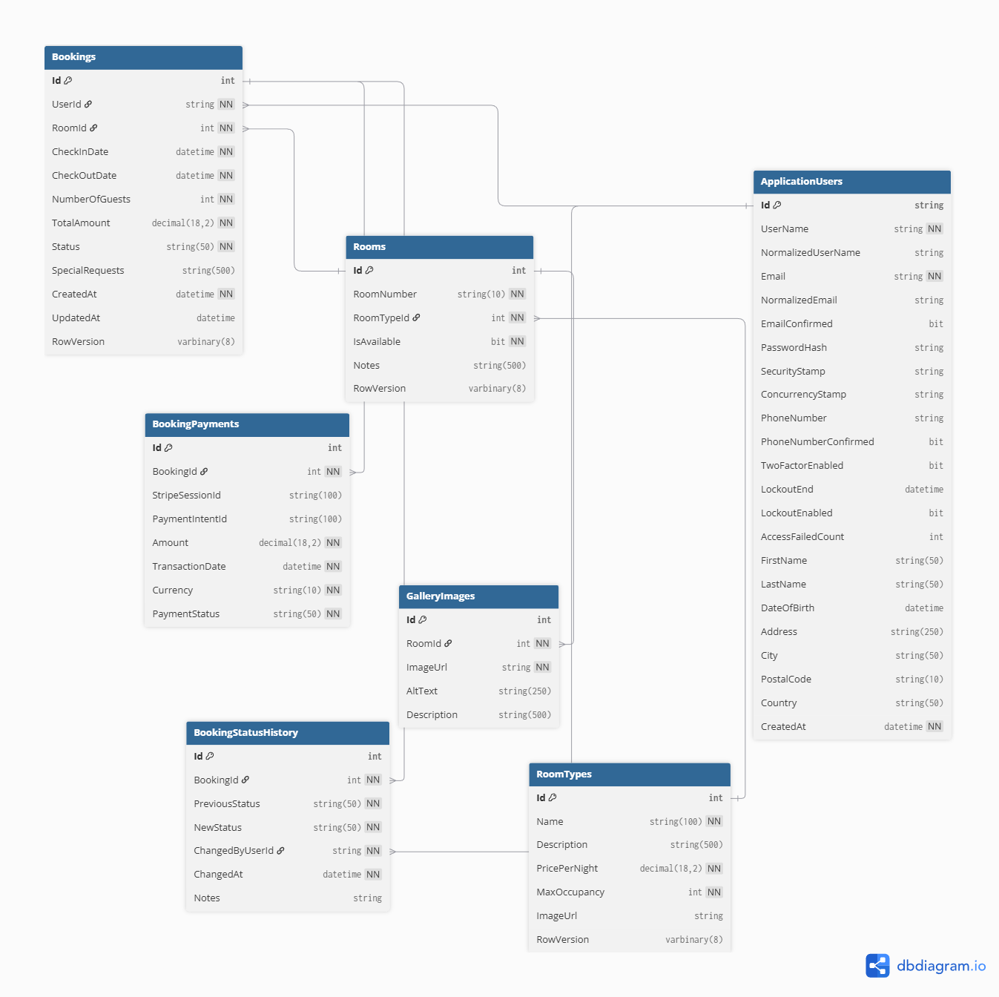
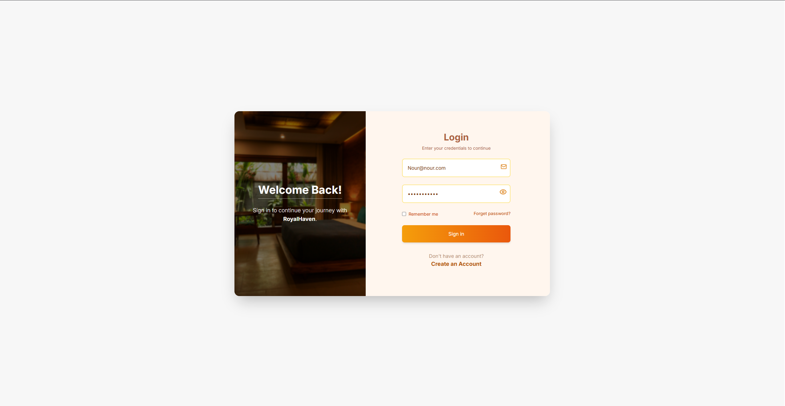
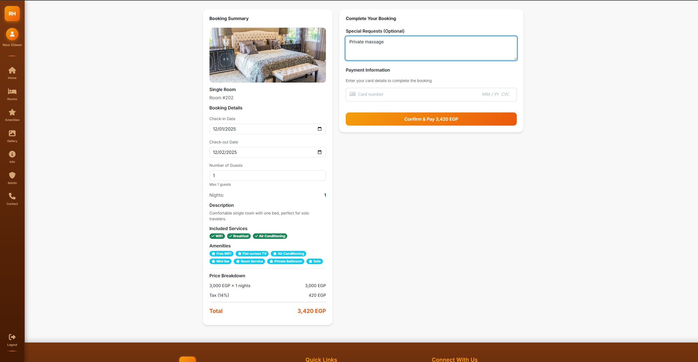
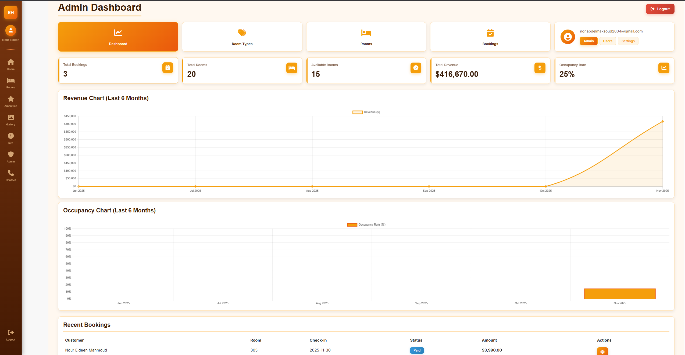
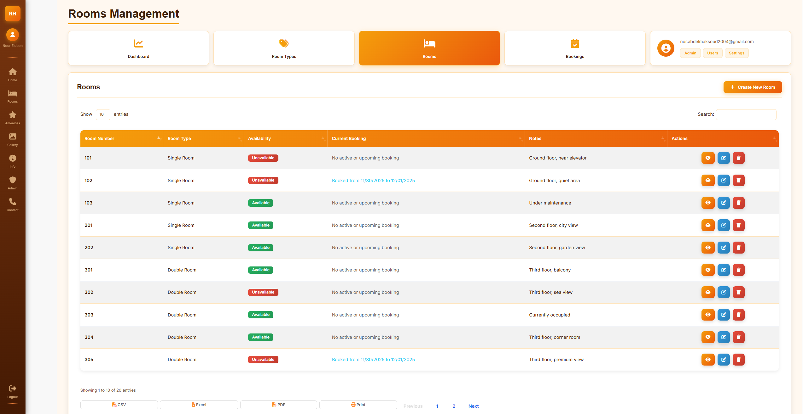
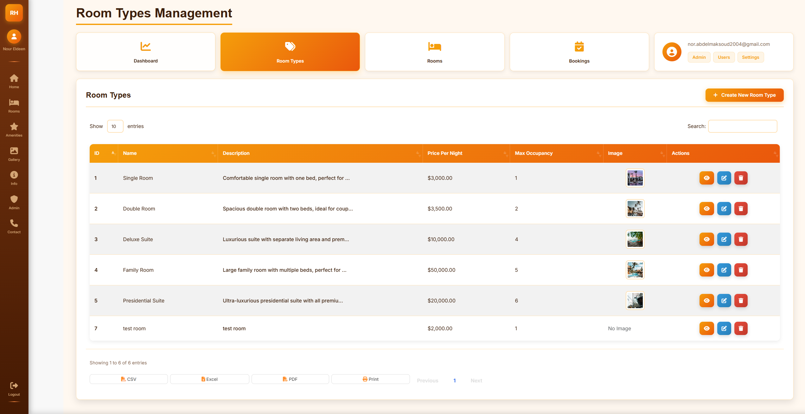

# Bookify Hotel Reservation System - Project Documentation

## Project Overview

**Bookify** is a comprehensive hotel reservation web application built with ASP.NET Core MVC. It provides a complete booking management system for hotels, allowing customers to search for available rooms, view room details, make reservations, and process payments securely. The application also includes a powerful admin panel for hotel staff to manage rooms, bookings, and customer data.

### Key Objectives
- Build a robust, scalable hotel booking platform
- Implement clean architecture with separation of concerns
- Ensure secure payment processing
- Provide intuitive user experience for both customers and admins
- Maintain data integrity through transactions

---
## Architecture

The application follows **N-Tier Architecture** with clear separation of concerns:

### Layers

1. **Presentation Layer (Bookify.Web)**
   - ASP.NET Core MVC Controllers
   - Razor Views
   - ViewModels
   - Client-side assets (CSS, JavaScript)
   - Filters and Middleware

2. **Business Logic Layer (Bookify.Services)**
   - Service interfaces and implementations
   - Business rules and validations
   - External service integrations (Stripe, SendGrid)

3. **Data Access Layer (Bookify.Data)**
   - Entity Framework Core DbContext
   - Repository Pattern implementation
   - Unit of Work Pattern
   - Entity configurations
   - Database migrations

### Architecture Diagram
```
┌─────────────────────────────────────┐
│   Presentation Layer (Bookify.Web)  │
│   - Controllers                     │
│   - Views                           │
│   - ViewModels                      │
└──────────────┬──────────────────────┘
               │
┌──────────────▼──────────────────────┐
│   Business Logic (Bookify.Services) │
│   - ReservationService              │
│   - PaymentService                  │
│   - RoomAvailabilityService         │
│   - EmailService                    │
└──────────────┬──────────────────────┘
               │
┌──────────────▼──────────────────────┐
│   Data Access (Bookify.Data)        │
│   - Repositories                    │
│   - Unit of Work                    │
│   - DbContext                       │
└──────────────┬──────────────────────┘
               │
┌──────────────▼──────────────────────┐
│   Database (SQL Server)             │
└─────────────────────────────────────┘
```

---
## Technology Stack

### Backend
- **.NET 9.0** - Latest .NET framework
- **ASP.NET Core MVC** - Web framework
- **Entity Framework Core 9.0.11** - ORM
- **ASP.NET Core Identity** - Authentication & Authorization
- **SQL Server** - Database

### Frontend
- **Bootstrap 5.3.0** - CSS framework
- **jQuery 3.7.1** - JavaScript library
- **DataTables 1.13.7** - Table plugin
- **Toastr.js** - Notification library
- **Font Awesome** - Icons

### External Services
- **Stripe** - Payment gateway
- **SendGrid** - Email service

### Development Tools
- **Serilog** - Structured logging
- **Health Checks UI** - Application monitoring
- **Entity Framework Migrations** - Database versioning

---
## Database Schema

### Entities



#### 1. **ApplicationUser** (extends IdentityUser)
- Inherits from ASP.NET Identity
- Additional properties: FirstName, LastName, DateOfBirth, Address, City, PostalCode, Country

#### 2. **RoomType**
- `Id` (int, PK)
- `Name` (string) - e.g., "Single", "Double", "Suite"
- `Description` (string, nullable)
- `PricePerNight` (decimal)
- `MaxOccupancy` (int)
- `ImageUrl` (string, nullable)
- `RowVersion` (byte[], for concurrency)

#### 3. **Room**
- `Id` (int, PK)
- `RoomNumber` (string) - Unique room identifier
- `RoomTypeId` (int, FK → RoomType)
- `IsAvailable` (bool)
- `Notes` (string)
- `RowVersion` (byte[], for concurrency)

#### 4. **Booking**
- `Id` (int, PK)
- `UserId` (string, FK → ApplicationUser)
- `RoomId` (int, FK → Room)
- `CheckInDate` (DateTime)
- `CheckOutDate` (DateTime)
- `NumberOfGuests` (int)
- `TotalAmount` (decimal)
- `Status` (BookingStatus enum)
- `SpecialRequests` (string, nullable)
- `CreatedAt` (DateTime)
- `UpdatedAt` (DateTime, nullable)
- `RowVersion` (byte[], for concurrency)

#### 5. **BookingPayment**
- `Id` (int, PK)
- `BookingId` (int, FK → Booking)
- `Amount` (decimal)
- `PaymentStatus` (PaymentStatus enum)
- `PaymentIntentId` (string) - Stripe Payment Intent ID
- `TransactionId` (string, nullable)
- `PaymentDate` (DateTime)
- `RefundAmount` (decimal, nullable)
- `RefundDate` (DateTime, nullable)

#### 6. **BookingStatusHistory**
- `Id` (int, PK)
- `BookingId` (int, FK → Booking)
- `PreviousStatus` (BookingStatus, nullable)
- `NewStatus` (BookingStatus)
- `ChangedBy` (string) - User ID
- `ChangedAt` (DateTime)
- `Notes` (string, nullable)

#### 7. **GalleryImage**
- `Id` (int, PK)
- `RoomId` (int, FK → Room)
- `ImageUrl` (string)
- `AltText` (string, nullable)
- `DisplayOrder` (int)

### Enums

#### BookingStatus
- `Pending` (0)
- `Paid` (1)
- `Cancelled` (2)
- `Completed` (3)

#### PaymentStatus
- `Pending` (0)
- `Completed` (1)
- `Failed` (2)
- `Refunded` (3)

### Relationships
- RoomType → Rooms (One-to-Many)
- Room → Bookings (One-to-Many)
- Room → GalleryImages (One-to-Many)
- ApplicationUser → Bookings (One-to-Many)
- Booking → BookingPayments (One-to-Many)
- Booking → BookingStatusHistory (One-to-Many)

---
## Features

### Customer Features

#### 1. **Room Search & Browsing**
- Search available rooms by date range
- Filter by room type, price, occupancy
- View room details with images
- Real-time availability checking
- Pagination for large result sets


#### 2. **User Authentication**
- User registration with validation
- Secure login with password requirements
- Password reset functionality
- Account lockout after failed attempts




#### 3. **Booking Management**
- View booking summary before checkout
- Complete booking with payment
- View booking history



#### 4. **Payment Processing**
- Secure payment via Stripe Payment Intent
- Payment confirmation emails


#### 5. **User Profile**
- View and update personal information
- View booking history
- Change password


### Admin Features

#### 1. **Dashboard**
- Overview statistics:
	- Total bookings
	- Pending/Paid bookings
	- Total rooms
	- Available rooms
	- Occupancy rate
	- Revenue (last 6 months)
- Recent bookings table
- Quick action cards



#### 2. **Room Management**
- Create, Read, Update, Delete (CRUD) for rooms
- Manage room availability
- Add notes to rooms



#### 3. **Room Type Management**
- CRUD operations for room types
- Set pricing per night
- Configure max occupancy



#### 4. **Booking Management**
- View all bookings
- Filter by status, date, customer
- Update booking status
- Process refunds
- View booking details and payment history


#### 5. **User Management**
- View all users
- Lock/unlock user accounts
- View user booking history
- Manage user roles


---
## Security

### Authentication & Authorization
- **ASP.NET Core Identity** for user management
- **Role-Based Access Control (RBAC)**
  - Admin role for admin panel access
  - Customer role for regular users
- **Password Requirements**:
  - Minimum 8 characters
  - Requires digit, lowercase, uppercase, non-alphanumeric
  - At least 1 unique character

### Account Security
- **Account Lockout**: 5 failed attempts → 10-minute lockout
- **Automatic vs Manual Lockout**:
  - Automatic: Failed login attempts → redirects to `/Account/Lockout`
  - Manual: Admin-imposed → redirects to `/Account/AccessDenied`
- **Cookie Security**:
  - HttpOnly cookies
  - SameSite=Strict
  - Secure policy
  - 30-day expiration with sliding expiration

### CSRF Protection
- **AutoValidateAntiforgeryTokenAttribute** on all POST requests
- Custom filter to exclude API routes
- Anti-forgery tokens in forms

### Data Protection
- **Concurrency Control**: RowVersion (byte[]) for optimistic concurrency
- **Input Validation**: Data Annotations on ViewModels
- **SQL Injection Prevention**: Parameterized queries via EF Core
- **XSS Prevention**: Razor encoding by default

### File Upload Security
- Maximum file size: 10MB
- File type validation
- Secure file storage

---
## External Integrations

### 1. Stripe Payment Gateway
- **Integration Type**: Payment Intent API (inline checkout)
- **Features**:
	- Create payment intents
	- Process payments
	- Handle payment confirmations
	- Process refunds
	- Idempotency support
- **Configuration**: Secret Key, Publishable Key in `appsettings.json`

### 2. SendGrid Email Service
- **Purpose**: Transactional emails
- **Features**:
	- Booking confirmation emails
	- Payment confirmation emails
	- Password reset emails
- **Configuration**: API Key, FromEmail, FromName in `appsettings.json`

### 3. Health Checks
- **Database Health Check**: Verifies SQL Server connectivity
- **Email Health Check**: Validates SendGrid API key and configuration
- **Payment Health Check**: Validates Stripe API key and connectivity
- **UI**: Available at `/health-ui`

---
## Project Structure

```
Bookify-Dev/
├── Bookify.Data/                    # Data Access Layer
│   ├── Data/
│   │   ├── AppDbContext.cs
│   │   ├── Configurations/          # EF Core configurations
│   │   ├── Enums/                   # BookingStatus, PaymentStatus
│   │   └── Seeding/                 # Database seeders
│   ├── Models/                      # Entity models
│   ├── Repositories/
│   │   ├── Interfaces/
│   │   ├── Implementations/
│   │   ├── IUnitOfWork.cs
│   │   └── UnitOfWork.cs
│   └── Migrations/                  # EF Core migrations
│
├── Bookify.Services/                # Business Logic Layer
│   ├── Interfaces/                  # Service interfaces
│   └── Services/                    # Service implementations
│
└── Bookify.Web/                     # Presentation Layer
    ├── Controllers/                 # MVC Controllers
    ├── Views/                       # Razor views
    ├── ViewModels/                  # View models
    ├── Filters/                     # Action filters
    ├── HealthChecks/                # Health check implementations
    ├── wwwroot/                     # Static files
    │   ├── css/
    │   ├── js/
    │   └── images/
    └── Program.cs                   # Application entry point

```

---
##  Design Patterns

### 1. Repository Pattern
- **Purpose**: Abstract data access logic
- **Implementation**:
  - `IRepository<T>` - Generic repository interface
  - `IRoomRepository` - Specific repository for rooms
  - `IBookingRepository` - Specific repository for bookings
- **Benefits**: Testability, maintainability, flexibility

### 2. Unit of Work Pattern
- **Purpose**: Manage transactions and coordinate repositories
- **Implementation**: `IUnitOfWork` and `UnitOfWork`
- **Benefits**: 
  - Ensures atomic operations
  - Single database context per request
  - Transaction management

### 3. Dependency Injection
- **Purpose**: Loose coupling, testability
- **Implementation**: Built-in ASP.NET Core DI container
- **Lifetime**: Scoped (per request)

### 4. ViewModel Pattern
- **Purpose**: Separate presentation from domain models
- **Examples**: `RoomViewModel`, `RoomTypeViewModel`, `CheckoutViewModel`
- **Benefits**: Prevents over-posting, better validation

### 5. Service Layer Pattern
- **Purpose**: Encapsulate business logic
- **Implementation**: Services in `Bookify.Services`
- **Benefits**: Reusability, testability, separation of concerns

---
## Controllers & Actions

### HomeController
- `Index()` - Home page with room listings
- `GetRoomsPartial()` - AJAX endpoint for room listings
- `SearchRooms()` - Search and filter rooms

### AccountController
- `Register()` - User registration
- `Login()` - User authentication
- `Logout()` - User sign out
- `ForgotPassword()` - Password reset request
- `ResetPassword()` - Password reset confirmation
- `Lockout()` - Account lockout page
- `AccessDenied()` - Access denied page

### RoomsController
- `Details(int id)` - Room details page

### BookingsController
- `Index()` - User's booking history
- `Details(int id)` - Booking details

### PaymentController
- `CreatePaymentIntent()` - Create Stripe payment intent
- `ConfirmPayment()` - Confirm payment and create booking
- `Refund(int bookingId)` - Process refund

### ProfileController
- `Index()` - User profile page
- `UpdateProfile()` - Update user information
- `ChangePassword()` - Change user password

### AdminController
- `Dashboard()` - Admin dashboard
- `RoomTypes()` - List room types
- `CreateRoomType()` - Create new room type
- `EditRoomType(int id)` - Edit room type
- `DeleteRoomType(int id)` - Delete room type
- `Rooms()` - List rooms
- `CreateRoom()` - Create new room
- `EditRoom(int id)` - Edit room
- `DeleteRoom(int id)` - Delete room
- `Bookings()` - List all bookings
- `BookingDetails(int id)` - Booking details
- `UpdateBookingStatus()` - Update booking status
- `Users()` - List all users
- `LockUser(string id)` - Lock user account
- `UnlockUser(string id)` - Unlock user account
- `GetRecentBookings()` - AJAX endpoint for recent bookings

---
## Setup & Installation

### Prerequisites
- .NET 9.0 SDK
- SQL Server (LocalDB or full instance)
- Visual Studio 2022 or VS Code
- Stripe account (for payments)
- SendGrid account (for emails)

### Steps

1. **Clone the repository**
   ```bash
   git clone <repository-url>
   cd Bookify-Dev
   ```

2. **Configure Database**
   - Update connection string in `appsettings.json`:
   ```json
   "ConnectionStrings": {
     "DefaultConnection": 
	     "Server=localhost;Database=BookifyDB;Trusted_Connection=True;
	     TrustServerCertificate=True;"
   }
   ```

3. **Run Migrations**
   ```bash
   cd Bookify.Web
   dotnet ef database update --project ../Bookify.Data
   ```

4. **Configure External Services**
   - Update `appsettings.json` with Stripe keys:
   ```json
   "Stripe": {
     "PublishableKey": "pk_test_...",
     "SecretKey": "sk_test_..."
   }
   ```
   - Update SendGrid configuration:
   ```json
   "SendGrid": {
     "ApiKey": "SG....",
     "FromEmail": "your-email@example.com",
     "FromName": "Bookify"
   }
   ```

5. **Run the Application**
   ```bash
   dotnet run --project Bookify.Web
   ```

6. **Access the Application**
   - Customer site: `https://localhost:7293`
   - Admin panel: `https://localhost:7293/Admin/Dashboard`
   - Health checks UI: `https://localhost:7293/health-ui`

### Default Admin Account
- Created via database seeding in Development environment
- Check `IdentitySeeder.cs` for credentials

---
## Configuration

### appsettings.json Structure
```json
{
  "Logging": {
    "LogLevel": {
      "Default": "Information",
      "Microsoft.AspNetCore": "Warning"
    }
  },
  "SendGrid": {
    "ApiKey": "SG...",
    "FromEmail": "email@example.com",
    "FromName": "Bookify"
  },
  "Stripe": {
    "PublishableKey": "pk_test_...",
    "SecretKey": "sk_test_..."
  },
  "ConnectionStrings": {
    "DefaultConnection": "Server=...;Database=...;..."
  },
  "AllowedHosts": "*"
}
```

### Serilog Configuration
- Logs to console and file
- File location: `logs/bookify-YYYYMMDD.log`
- Retention: 30 days
- Rolling interval: Daily

---
## Future Enhancements

### Potential Features
1. **Email Confirmation**: Require email verification
2. **Two-Factor Authentication**: Add 2FA support
3. **Reviews & Ratings**: Customer reviews for rooms
4. **Loyalty Program**: Points and rewards system
5. **Multi-language Support**: i18n implementation
6. **Mobile App**: Native mobile application
7. **Real-time Notifications**: SignalR integration
8. **Advanced Analytics**: Detailed reporting and analytics
9. **Room Recommendations**: AI-based suggestions
10. **Calendar View**: Visual booking calendar

### Technical Improvements
1. **Unit Tests**: Add comprehensive unit tests
2. **Integration Tests**: End-to-end testing
3. **API Versioning**: RESTful API with versioning
4. **Caching**: Redis caching for performance
5. **Background Jobs**: Hangfire for scheduled tasks
6. **Microservices**: Split into microservices if needed

---
## Support & Contact

For questions or issues:
- Check the codebase documentation
- Review the `req.txt` file for original requirements
- Contact the development team

---
## Acknowledgments

- ASP.NET Core team
- Stripe for payment processing
- SendGrid for email services
- All open-source contributors

---

**Document Version**: 1.0  
**Last Updated**: 30/11/2025  
- **Maintained By**:
	- Nour Eldeen Mahmoud ( Team Leader / Back End | [GitHub](https://github.com/NourEldeenMahmoud))
	- Hazem Hany Samy (Front End | [GitHub](https://github.com/Hazem7any))
	- Omar Ashraf (Front End | [GitHub](https://github.com/omarabaset11))
	- Shahd Ayman ( Back End | [GitHub](https://github.com/shahdayman315315))
	- Alia Harb (Back End | [GitHub](https://github.com/AliaHarb))
	- Mohamed Soultan (Back End | [LinkedIn](https://www.linkedin.com/in/mohamedsoultann/))

